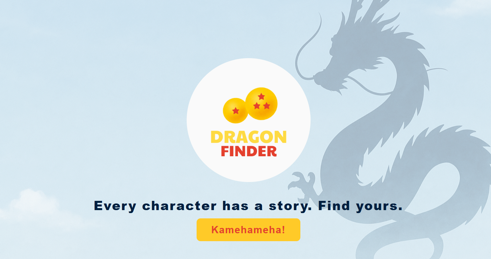
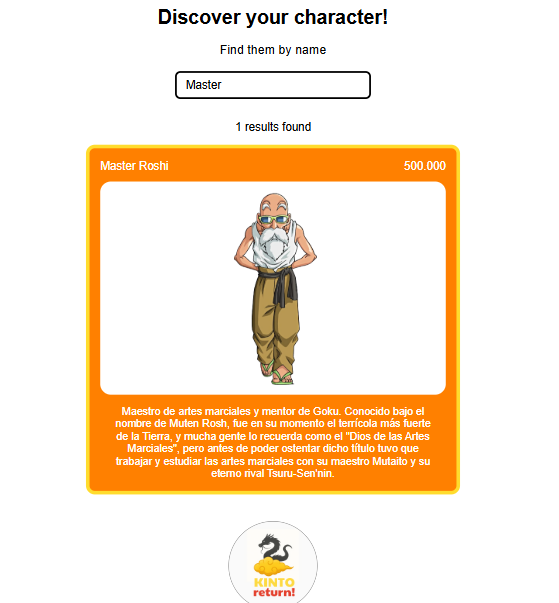

# 🐉 Dragon Ball Finder

They say that to find the legendary Dragon Balls, you must first know the characters who live in this universe...  
This app helps you begin that journey: searching and discovering the characters of **Dragon Ball** 🌍

## 🖼️ Screenshots (Landing & Finder)

**Landing Page**  

**Finder Page**  

### ✨ Current Features

- Search for characters by **name** in real time.
- View a **card** with image, description, and base power (_ki_).
- Navigate between a **custom landing page** and the search page, guided by Kinto, the magic cloud ☁️.
- _Note: All images and text used in this project respect copyright laws.  
The logos were designed by me, the images come from royalty-free image banks, and the written content was created for this app._

### 📌 Upcoming Improvements

I’m working beyond the suggested 2-hour time approximation to implement a new feature: the **ki range filter** (`From` / `To`).

Following an iterative approach inspired by Agile/Scrum, I delivered a first functional and usable version of the application, focused on name search and user experience — including an expandable detail card for each character.
This way, the app can already be enjoyed while continuing to grow through small, incremental deliveries.  
The new feature will be available soon and accessible online via GitHub Pages.

## 🛠 Technologies Used

- **React + Vite** – Main stack used to build and run the app.
- **React Router** – For navigation between landing and search views.
- **Fetch API** – To get character data from the API.
- **CSS Flexbox** – To arrange and align page elements.
- **Dragon Ball API** – Data source used: [https://web.dragonball-api.com/documentation](https://web.dragonball-api.com/documentation)
- **Git (with branches)** – I use `dev` for development and `main` as the stable production branch.
- **GitHub Pages** – Used to deploy the app statically from the `/docs` folder, generated with Vite.

## 📚 Resources

This project uses a **small personal development guide** that helps me start new applications quickly and consistently.  
It includes a basic set of styles, reusable components, utility functions like `fetch` and logic for forms or filters, among others.  
Thanks to this, I can focus on functionality without starting everything from scratch.

## 🧱 Reusable Structure

The landing page is part of that small guide. It’s a pre-built section that only needs light updates (such as text or images) and integrates easily into each new project.

## 🚀 Deployment

The app is deployed using **GitHub Pages**.  
I use a script already configured to build the project with Vite and move the output files to the `/docs` folder, so GitHub can serve them from the `main` branch.

## and... more future improvements
- **Reset** button to clear filters.  
- Split the app into **reusable components**.  
- Show **error messages** if no results or data issues.  
- Add a **loading spinner** during fetch.  
- Try new filters: **race, planet, or max ki**.

Good luck on your journey!  
Kame... hame... ha! 🔥🐉

---

# 🐉 Dragon Ball Finder

Dicen que para encontrar las legendarias bolas de dragón, primero debes conocer bien a los personajes que habitan su universo...  
Esta aplicación te permite empezar ese viaje: buscando y descubriendo a los personajes de **Dragon Ball** 🌍

## 🖼️ Capturas (Landing y Buscador)

**Landing Page**  

**Página de búsqueda**  

### ✨ Funcionalidades actuales

- Buscar personajes por **nombre** en tiempo real.
- Ver una **carta desplegable** con imagen, descripción y poder base (_ki_).
- Navegar entre una **landing page personalizada** y el buscador, guiado por Kinto, la nube mágica ☁️.
- _Nota: Todas las imágenes y textos utilizados en este proyecto respetan las leyes de derechos de autor.  
Los logos han sido diseñados por mí, las imágenes provienen de bancos de imágenes libres y los textos han sido escritos para esta app._

### 📌 Próximas mejoras

Estoy trabajando más allá de la aproximación de 2 horas sugerida para implementar una nueva funcionalidad: el **filtro por rango de Ki** (`From` / `To`).
Siguiendo un enfoque iterativo inspirado en metodologías Agile/Scrum, he entregado una primera versión funcional y utilizable de la aplicación, centrada en la búsqueda por nombre y la experiencia de usuario, incluyendo una tarjeta de detalle desplegable por personaje.
 
De este modo, la aplicación ya puede disfrutarse mientras evoluciona con nuevas entregas incrementales.  
La nueva funcionalidad estará disponible pronto y se podrá probar online a través de GitHub Pages.

## 🛠 Tecnologías utilizadas

- **React + Vite** – Stack principal del proyecto. Vite permite desarrollar y compilar aplicaciones React de forma rápida y moderna.
- **React Router** – Para la navegación entre la landing page y el buscador.
- **Fetch API** – Para obtener los datos de los personajes desde la API.
- **CSS Flexbox** – Para estructurar y alinear los elementos visualmente.
- **Dragon Ball API** – Fuente de datos utilizada: [https://web.dragonball-api.com/documentation](https://web.dragonball-api.com/documentation)
- **Git (con ramas)** – Uso de `dev` para desarrollo y `main` como rama estable para producción.
- **GitHub Pages** – Usado para desplegar la aplicación desde la carpeta `/docs`, generada con Vite.

## 📚 Recursos

Este proyecto utiliza una **pequeña guía de desarrollo propia**.
Incluye una pequeña muestra de estilos base, componentes reutilizables, funciones como `fetch`, lógica para formularios o filtros, entre otras.  
Gracias a esto, puedo centrarme en la funcionalidad sin tener que empezar desde cero cada vez.

## Reutilización de estructura

La landing page forma parte de esa pequeña guía. Es una sección ya preconstruida que solo necesita pequeñas actualizaciones (como textos o imágenes) y se integra fácilmente en cada nuevo proyecto.

## 🚀 Deploy

Uso un script para construir el proyecto con Vite y mover los archivos generados a la carpeta `/docs`, desde donde GitHub publica el contenido en la rama `main`.

## y... más mejoras futuras

- Botón de **reset** para limpiar los filtros.  
- Separar partes en **componentes reutilizables**.  
- Mostrar **mensajes de error** si no hay resultados o fallan los datos.  
- Añadir **loading** mientras se cargan los personajes.  
- Explorar nuevos filtros: **raza, planeta o poder máximo**.

¡Suerte en tu búsqueda!  
Kame... hame... ¡ha! 🔥🐉
